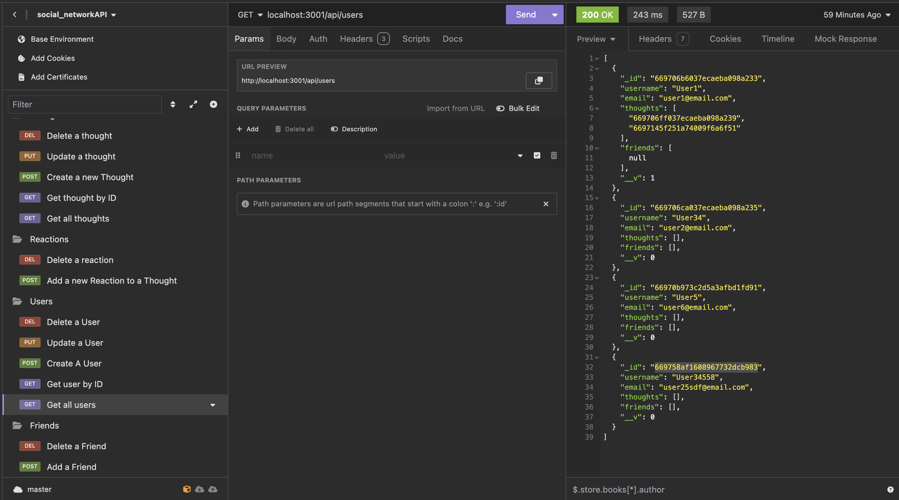
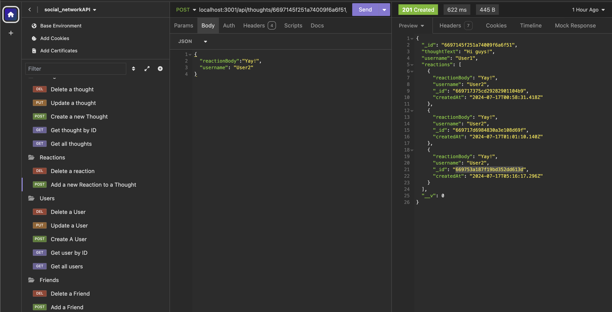
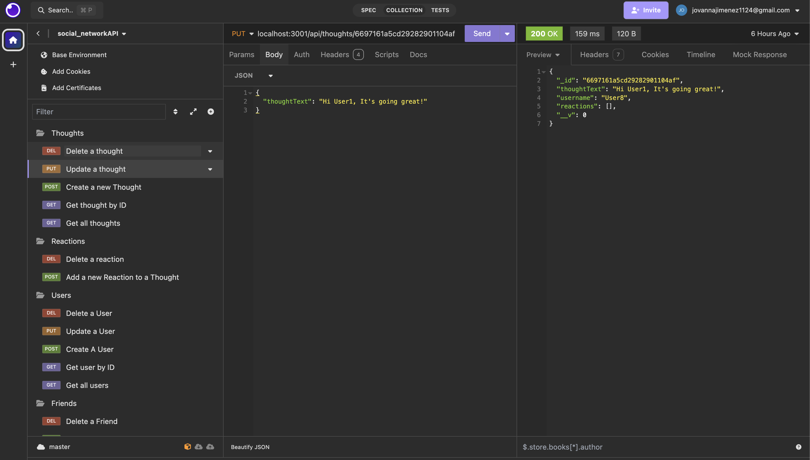

# Social Network API

## Table of Contents 
- [Description](#description) 
- [Installation](#installation)
- [Usage](#usage)
- [Testing](#testing)
- [Contribution](#contribution)
- [Examples](#examples)
- [License](#license)
- [Questions](#questions)

## Description 
    The Social Network API is built using Node.js, Express.js, and MongoDB with Mongoose. It provides endpoints to manage users, thoughts, reactions to thoughts, and friend relationships between users.

## Installation 
    To install the necessary dependencies, run the following command: 
    npm install

## Usage 
    To start the server, use the following command:

    npm start

### Syncing Models
    When the application starts (npm start), Mongoose models are automatically synced with the MongoDB database.

## Testing 
    Insomnia Testing
    Make sure to have Insomnia or similar API testing tool installed.

- GET Routes
    - Users: /api/users
    - Thoughts: /api/thoughts
    - Example: Open Insomnia and perform GET requests to these routes to see formatted JSON responses.

- POST, PUT, DELETE Routes
    - Users: /api/users
        - POST: Create a new user
        - PUT: Update an existing user
        - DELETE: Delete a user
    - Thoughts: /api/thoughts
        - POST: Create a new thought
        - PUT: Update an existing thought
        - DELETE: Delete a thought
    - Reactions: /api/thoughts/:thoughtId/reactions
        - POST: Create a reaction to a thought
        - DELETE: Delete a reaction from a thought
    - Friend Management: /api/users/:userId/friends/:friendId
        - POST: Add a friend
        - DELETE: Remove a friend

## Contribution 
- Handlebars documentation: https://handlebarsjs.com/
- Sequelize documentation: https://sequelize.org/docs/v6/ 
- Dotenv documentation: https://www.npmjs.com/package/dotenv
- Node-postgress documentation: https://www.npmjs.com/package/pg
- Mini-Project: Travel Planner
- BootCampSpot Tutoring Services

## Examples  
- 
- 
- 

## License 
    N/A

## Questions 
    For any questions, please contact [jovanna24](https://github.com/jovanna24) at jovannajimenez1124@gmail.com.